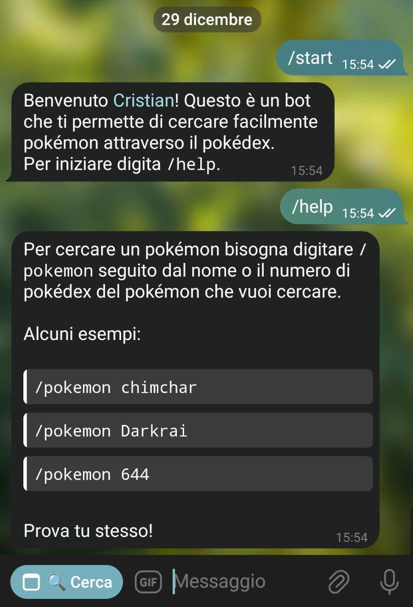
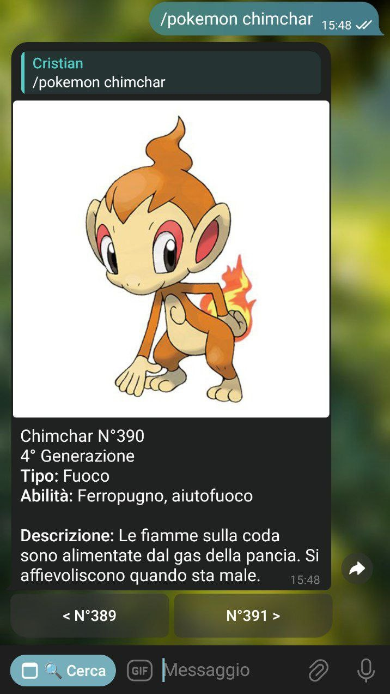
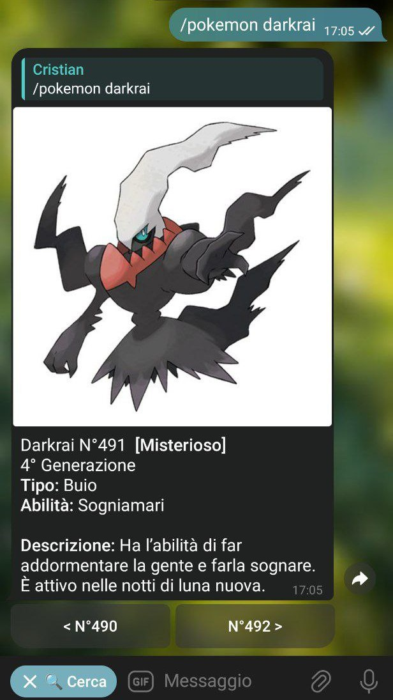
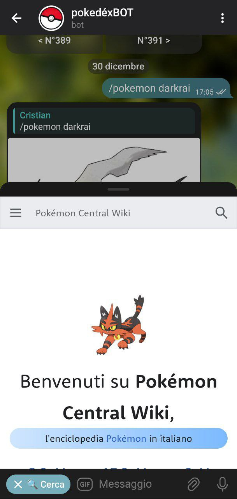

 # The Pokédex Telegram Bot

- [The Pokédex Telegram Bot](#the-pokédex-telegram-bot)
- [Bot commands](#bot-commands)
  - [Start](#start)
  - [Help](#help)
  - [Search a pokémon](#search-a-pokémon)
    - [Inline Keyboard](#inline-keyboard)
    - [Additional Features](#additional-features)
  - [Menu Button](#menu-button)
- [Software Architecture](#software-architecture)
  - [Docker](#docker)
  - [PokeAPI](#pokeapi)
  - [Redis](#redis)
- [How to run the bot](#how-to-run-the-bot)
  - [Build the docker image](#build-the-docker-image)
  - [Run the docker image](#run-the-docker-image)
- [How to run the bot (with Redis)](#how-to-run-the-bot-with-redis)
  - [Run the docker compose](#run-the-docker-compose)
  - [Run and build the docker compose](#run-and-build-the-docker-compose)

<br />

This project is a telegram bot that functions as a pokédex.

It is able to return important information (including an image) about a specific pokémon, given in input with the `/pokemon {pokemon}` command.

# Bot commands

## Start

The `/start` command shows you basic information about how the bot works and its purpose

## Help

The `/help` command shows you how to use the bot to display pokémons information

<br/>


<br/>


<i>An example of the messages displayed by the start and help messages</i>

## Search a pokémon

The `/pokemon` shows information about a specific information.
The pokemon can be specified either with its name or its id. It is case unsensitive.

### Inline Keyboard
Furthermore, the message with all of the pokemon info comes with a `inline keyboard`, that makes easier to go through all the pokédex. The are three buttons:
- the first one shows you the previous pokémon;
- the second one shows you a variant of the pokémon species. It doesn't appear if the aren't any;
- the last one shows you the next pokémon

Since this functionality might have easily filled the chat with many unwanted messages, everytime you use the keyboard the last message will be automatically deleted.

### Additional Features

Every time you search a pokémon with the command the message will display the reply flag to your text.

In the message might also appear special "tags" next to the pokémon name that indicates if it has any particularity.

<br/>

<p float="left">
  
  
</p>

<br/>

<i>Examples of the pokemon command</I>


## Menu Button

Moreover there is a menu button in the chat that's linked to a pokémon wiki.
On the tap, it shows you the page and you're able to do your own research.

<br>



<br>

# Software Architecture


<br />

## Docker

Docker is a technology that allows to package an application along with all of its dependencies into a standardized unit for software development.
This allows for complete reproducibility of the application, regardless of the environment in which it is run.

## PokeAPI

It retrieves information from PokeAPI, a full RESTful API linked to an extensive database detailing everything about the Pokémon main game series.

## Redis

To make able the bot to run faster, it runs along with Redis, a open source data structure store used as a database. So before it starts making the requests to the API, it checks if those requests have been already made and cached into Redis. In this way, the bot can avoid making additional requests for pokémon that have been already requested.

<br/>

# How to run the bot

## Build the docker image

```
docker build -t pokedex-telegram-bot .
```

## Run the docker image
```
docker run pokedex-telegram-bot
```

<br>

# How to run the bot (with Redis)

## Run the docker compose

```
docker compose up
```

## Run and build the docker compose

```
docker compose up --build
```
